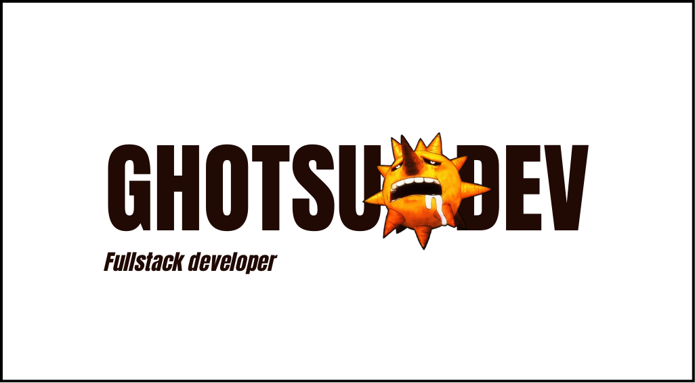

  

## Hi everyone, 
I’m GhotsuDev a software developer student (engineer soon!), so if you can tell me how to be better in this world we could be friends.

## Skills:

## About Me...
- 🔭 I’m currently working on web projects
- 🌱 I’m currently learning good practice
- 👯 I’m looking to collaborate on international projects
- 🤔 I’m looking for help with how be better UI/UX

## History

  

<!--
**GhotsuDev/GhotsuDev** is a ✨ _special_ ✨ repository because its `README.md` (this file) appears on your GitHub profile.

Here are some ideas to get you started:

- 💬 Ask me about ...
- 📫 How to reach me: ...
- 😄 Pronouns: ...
- ⚡ Fun fact: ...
-->
